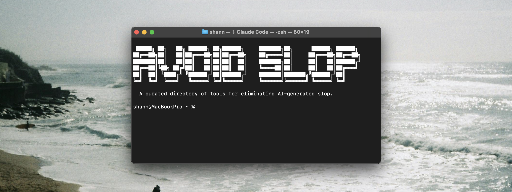

  

Open-source tools for eliminating AI-generated slop from text, code, and design.

AI models have defaults they collapse toward. The same phrases, the same layouts, the same color palettes. These tools fight that.

---

## The Tools

### [humanizer](https://github.com/blader/humanizer)

An agent skill that removes signs of AI-generated writing from text. By blader. MIT. 10,300+ stars.

> Based on Wikipedia's "Signs of AI writing" guide, maintained by WikiProject AI Cleanup. Covers 25 pattern categories: inflated significance, promotional language, superficial -ing analyses, vague attributions, AI vocabulary words, em dash overuse, rule of three, negative parallelisms, sycophantic tone, filler phrases, and more.

`npx skills add blader/humanizer@humanizer -g -y` or clone directly into your skills directory. Works as a slash command (`/humanizer`) in Claude Code and other agents.

What sets it apart from a simple word blocklist: it runs a two-pass audit. First rewrite, then it asks "what makes this obviously AI generated?" about its own output and revises again. The self-critique loop catches patterns that survive the first edit.

Also pushes you to add voice, not just remove slop. Sterile, voiceless writing is just as obvious as the bad patterns. The skill explicitly checks for opinions, varied rhythm, and first-person perspective where appropriate.

---

### [stop-slop](https://github.com/hardikpandya/stop-slop)

A skill file for removing AI tells from prose. By Hardik Pandya. MIT. 2,100+ stars.

> About 30 banned phrases across 7 categories (throat-clearing openers, emphasis crutches, business jargon, adverbs, meta-commentary), 8 banned structural patterns, and a scoring rubric that triggers revision when writing scores below 35/50.

Drop the skill file into Claude Projects, custom instructions, or API system prompts. No build step, no dependencies.

The best idea in here is "false agency" detection. AI gives inanimate things human verbs ("the data tells us", "the market rewards") to avoid naming actual actors. Naming the human fixes it.

Em-dashes are categorically banned. Not "use sparingly." Banned.

---

### [unslop](https://github.com/mshumer/unslop)

Detects a model's default patterns empirically, then generates a custom avoidance profile. By Matt Shumer. MIT. 180+ stars.

> Generates 50+ domain-specific outputs from a model, runs statistical analysis on recurring defaults, and writes a custom `skill.md` telling the model what to avoid. Visual mode screenshots HTML outputs to catch CSS/layout/color cliches too.

Clone the repo, set up a Python venv, run `python3 unslop.py --domain "blog writing"`. Ships with prebuilt profiles for writing and React design.

The clever part: Claude analyzes its own corpus to find its own defaults. No human has to guess which patterns are overused. The data shows it.

The philosophy is anti-prescription. Telling a model to write "better" just creates a new flavor of slop. Listing what *not* to do forces novelty rather than template substitution.

---

### [impeccable](https://github.com/pbakaus/impeccable)

A design language and command toolkit for making AI-generated frontends look human-designed. By Paul Bakaus. Apache 2.0. 11,700+ stars.

> Loads design expertise (typography, color theory, spatial design, motion, interaction design) as persistent LLM context. Has 20 slash commands (`/audit`, `/polish`, `/critique`, `/bolder`, `/quieter`, `/colorize`, `/animate`, `/overdrive`) for steering design quality. The `/critique` command runs an "AI Slop Detection" check as its first pass.

Install from [impeccable.style](https://impeccable.style) or copy from the repo. Works with Claude Code, Cursor, Gemini CLI, Codex CLI, VS Code Copilot, and more.

The distinctiveness test is the standout idea: "Would a viewer immediately identify this as AI-made?" as a concrete quality metric, not a vibe check.

Worth noting: stop using HSL. Use OKLCH. Pure gray is a mistake. Add 0.01 chroma of your brand hue to all neutrals for subconscious cohesion.

---

## Comparison

| | humanizer | stop-slop | unslop | impeccable |
|---|---|---|---|---|
| Domain | Any text | Written prose | Any (text, visual, code) | Frontend UI/UX |
| Approach | Pattern detection + self-critique | Curated editorial rules | Empirical detection + profiling | Design expertise injection |
| Setup | `npx skills add` or clone | Drop-in (copy a file) | CLI workflow (Python) | Install or copy skills |
| Customization | Edit the skill file | Edit the rules by hand | Auto-generates per domain | `/teach-impeccable` creates project context |
| Philosophy | Detect, rewrite, self-audit | Ban the bad patterns | Measure defaults, suppress them | Inject enough knowledge to choose well |
| Best for | Anyone editing AI-generated text | Writers, content teams | Building domain-specific profiles | Developers shipping frontend |

## What they agree on

All four tools identify the same problem: LLMs collapse to defaults. They attack it differently, but share one conviction: prescribing a "better" style just creates new slop. The fix is either removing defaults or adding enough context that the model can make informed choices on its own.

---

## Contributing

Know of another tool or technique for fighting AI slop? Open a PR or issue. The bar: open-source, actively maintained, and takes a specific, opinionated stance rather than offering generic "write better" advice.

## License

MIT
